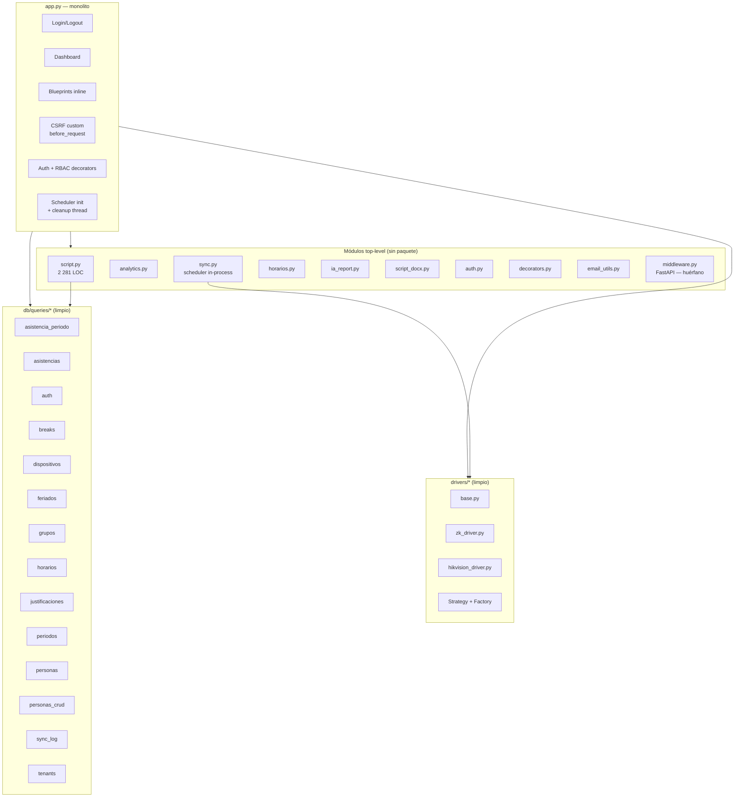
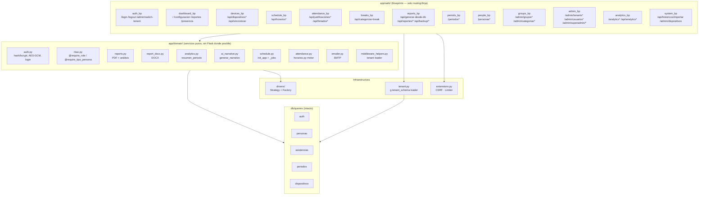
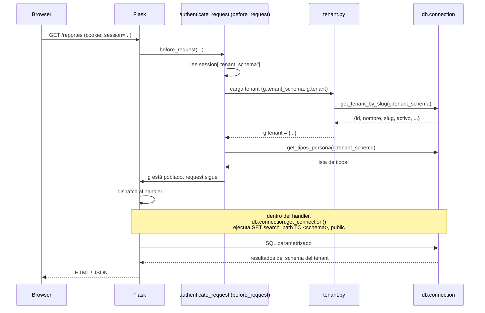
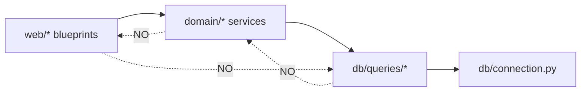
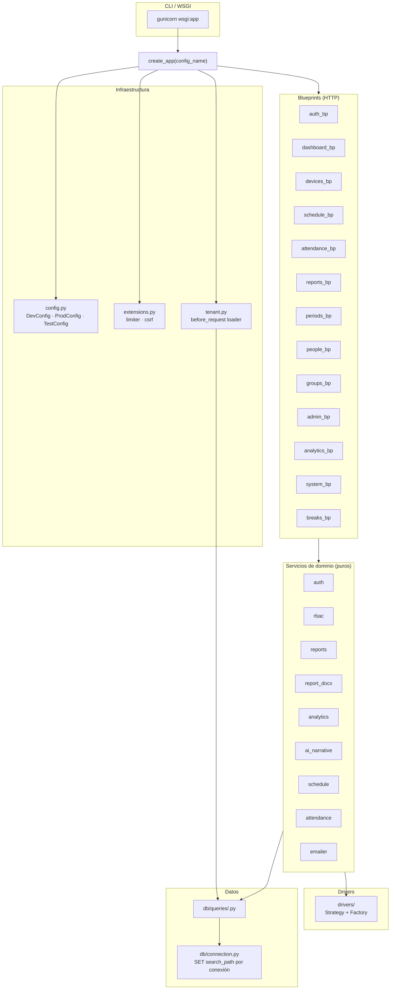

# Arquitectura del Sistema Biométrico

## Resumen ejecutivo

`biometric_sistem_reports` es una aplicación web Flask 3 sobre Python 3.12 que centraliza el registro de
asistencia biométrica (dispositivos ZK e Hikvision) para instituciones multi-tenant sobre PostgreSQL 16.
Persiste datos en un esquema `public` (cross-tenant: `usuarios`, `tenants`, `audit_log`, `login_intentos`)
y un esquema por tenant (datos operativos: `personas`, `asistencias`, `justificaciones`, `feriados`,
`horarios`, `grupos`, `categorias`, `periodos_vigencia`); cada conexión aplica `SET search_path` por
tenant antes de ejecutar SQL. La autenticación se apoya en sesión Flask + bcrypt + CSRF custom, con AES-256-GCM
para cifrar las credenciales de los dispositivos biométricos en la BD.

El estado actual del repositorio es de **monolito Flask**: 2 512 líneas en `app.py` con 81 rutas
registradas y 61 decoradores de RBAC, módulos top-level (`script.py` 2 281 líneas, `analytics.py`,
`sync.py`, `horarios.py`, `ia_report.py`, `script_docx.py`, `auth.py`, `decorators.py`,
`email_utils.py`, `middleware.py`) conviven sin contrato claro entre "servicio de dominio" y "ruta HTTP".
La capa de datos (`db/queries/*.py`) y los drivers (`drivers/` Strategy + Factory) sí están limpios y se
respeta su organización. La arquitectura objetivo, detallada en [[ADR-0001-modularizacion-monolito-flask]],
es migrar a **Application Factory + Blueprints por dominio + servicios en `app/domain/*`** para reducir
riesgo de merge, habilitar tests aislados y mantener el deploy actual (`gunicorn --workers 1 --threads 4`).

El sistema se ejecuta en producción como un solo contenedor Docker con `gunicorn --workers 1 --threads 4`
(dado el scheduler in-process basado en `schedule` y un dict `_jobs` en memoria), expone HTTP bajo el
prefijo `/biometrico` mediante `DispatcherMiddleware`, y consume la BD vía SQLAlchemy Core + `text()`
parametrizado (sin ORM declarativo). El scheduler ejecuta sync nocturna completa + sync incremental cada
N horas; el patrón es **monolito modular**, no microservicios: el `middleware.py` huérfano (FastAPI) no se
importa desde la app y queda como deuda documentada para extraer o eliminar.

---

## Vista de capas actual (pre-refactor)



### Señales del monolito

| Señal | Valor verificado | Implicación |
|---|---|---|
| `app.py` LOC | **2 512** | Único archivo concentra routing, auth, middleware, helpers de reporte, PDF, decoradores, jobs. |
| Rutas (`@app.route`) | **81** | Cualquier merge toca todas. |
| Decoradores RBAC | **61** (`@require_role` / `@require_tipo_persona`) | Política de acceso entremezclada con la lógica. |
| `script.py` LOC | **2 281** | Motor de reporte acoplado a la app web. |
| `middleware.py` | **206 LOC FastAPI** | Microservicio sin integrarse; deuda. |
| `auth.py` | Imports locales de `db.queries.auth` dentro de cada función (líneas 94, 116, 131, 147, 153, 159) | Anti-patrón por miedo a ciclos. |
| `decorators.py` | Estable (114 líneas) pero acoplado a `flask.session/g` | Listo para moverse a `app/domain/rbac.py`. |
| `sync.py` | 305 líneas con `threading.Thread(target=_cleanup_temp_files)` + `iniciar_scheduler()` | Acoplamiento al `--workers 1`. |
| `before_request` | `app.py:156-227` mezcla 5 responsabilidades | Acoplamiento vertical. |

---

## Vista de capas objetivo (post-refactor)



Regla visual: las flechas **solo bajan**. Cualquier flecha hacia arriba es un ciclo y bloquea el PR.

---

## Estructura de carpetas completa

```
biometric_sistem_reports/
├── app/                                # Paquete principal (post-refactor)
│   ├── __init__.py                     # create_app() factory
│   ├── config.py                       # Clases DevConfig / ProdConfig / TestConfig
│   ├── extensions.py                   # limiter, csrf (instancia única)
│   ├── errors.py                       # handlers 401/403/404/429/500
│   │
│   ├── domain/                         # Servicios de dominio (sin Flask donde posible)
│   │   ├── __init__.py
│   │   ├── auth.py                     # ← de auth.py (raíz) — bcrypt + AES-GCM
│   │   ├── rbac.py                     # ← de decorators.py — @require_role / @require_tipo_persona
│   │   ├── reports.py                  # ← de script.py — analizar_dia / generar_pdf
│   │   ├── report_docx.py              # ← de script_docx.py
│   │   ├── analytics.py                # ← de analytics.py (sin imports web)
│   │   ├── ai_narrative.py             # ← de ia_report.py
│   │   ├── schedule.py                 # ← de sync.py — scheduler + jobs (init_app)
│   │   ├── attendance.py               # ← de horarios.py — motor .ods/.obd
│   │   ├── emailer.py                  # ← de email_utils.py
│   │   └── middleware_helpers.py       # ← tenant loader, request helpers
│   │
│   ├── web/                            # Blueprints — solo routing/Jinja
│   │   ├── __init__.py
│   │   ├── auth_bp.py                  # /login /logout /admin/switch-tenant
│   │   ├── dashboard_bp.py             # /  /configuracion /justificaciones-vista /reportes /descargar /presencia
│   │   ├── devices_bp.py               # /api/dispositivos*  + /api/estado-sync /api/sincronizar /api/sync-status
│   │   ├── schedule_bp.py              # /api/horarios* CRUD
│   │   ├── attendance_bp.py            # /api/justificaciones* /api/feriados*
│   │   ├── breaks_bp.py                # /api/categorizar-break
│   │   ├── reports_bp.py               # /api/generar-desde-db /api/reportes/enviar-email /api/backup/*
│   │   ├── periods_bp.py               # /periodos* + /api/personas-db/lista /api/personas-lista
│   │   ├── people_bp.py                # /personas* /personas/historico
│   │   ├── groups_bp.py                # /admin/grupos* /admin/categorias*
│   │   ├── admin_bp.py                 # /admin/tenants* /admin/usuarios* /api/superadmin/usuarios*
│   │   ├── analytics_bp.py             # /analytics* /api/analytics* /api/alertas/tardanzas-severas
│   │   └── system_bp.py                # /api/historicos/importar /admin/dispositivos
│   │
│   └── tenant.py                       # resolve / g.tenant_schema loader
│
├── db/                                 # ← SE RESPETA INTACTO
│   ├── __init__.py                     # re-exports
│   ├── connection.py                   # get_connection / set_thread_tenant / clear_thread_tenant
│   ├── init.py                         # init_db (DDL idempotente + seed — NO ejecuta Alembic; ver riesgo "Migraciones duales")
│   ├── schema.py                       # modelo ER (PostgreSQL schema por tenant)
│   ├── migrations/                     # Alembic
│   └── queries/                        # 15 módulos por dominio (no ciclos)
│       ├── asistencia_periodo.py
│       ├── asistencias.py
│       ├── auth.py
│       ├── breaks.py
│       ├── dispositivos.py
│       ├── feriados.py
│       ├── grupos.py
│       ├── horarios.py
│       ├── justificaciones.py
│       ├── periodos.py
│       ├── personas.py
│       ├── personas_crud.py
│       ├── sync_log.py
│       └── tenants.py
│
├── drivers/                            # ← SE RESPETA — Strategy + Factory
│   ├── base.py
│   ├── zk_driver.py
│   ├── hikvision_driver.py
│   └── __init__.py
│
├── templates/                          # Jinja2 (no se tocan)
├── static/
│
├── tests/                              # NUEVO — pytest
│   ├── conftest.py
│   ├── unit/
│   │   ├── test_rbac.py
│   │   ├── test_reports.py
│   │   └── test_analytics.py
│   └── integration/
│       ├── test_auth_flow.py
│       └── test_periodos_e2e.py
│
├── docs/
│   ├── ER.md                           # actual
│   ├── SUPERADMIN.md                   # actual
│   ├── README.md
│   ├── ARQUITECTURA.md                 # ← este doc
│   ├── API.md                          # ← inventario de las 81 rutas
│   ├── AUTENTICACION.md                # ← flujo auth completo
│   └── adr/
│       ├── README.md
│       ├── 0000-use-markdown-for-adrs.md
│       └── 0001-modularizacion-monolito-flask.md
│
├── wsgi.py                             # NUEVO — entrypoint para gunicorn: `wsgi:app`
├── pyproject.toml                      # opcional (ruff/black config)
├── alembic.ini
├── docker-compose.yml
├── Dockerfile                          # gunicorn wsgi:app (no app:app)
├── .env.example
├── requirements.txt
└── README.md

# Estado actual (pre-refactor) — se conserva durante la transición:
├── app.py                              # shim: `from app import create_app; app = create_app()`
├── auth.py                             # se moverá a app/domain/auth.py
├── decorators.py                       # se moverá a app/domain/rbac.py
├── script.py                           # se moverá a app/domain/reports.py (motor) + app/web/reports_bp.py
├── script_docx.py                      # se moverá a app/domain/report_docx.py
├── analytics.py                        # se moverá a app/domain/analytics.py
├── ia_report.py                        # se moverá a app/domain/ai_narrative.py
├── sync.py                             # se moverá a app/domain/schedule.py
├── horarios.py                         # se moverá a app/domain/attendance.py
├── email_utils.py                      # se moverá a app/domain/emailer.py
└── middleware.py                       # FastAPI — extraer o eliminar
```

### Notas por paquete

- **`app/`** — Paquete principal post-refactor. Cualquier nuevo código va aquí.
- **`app/domain/`** — Servicios puros. Si no necesitan Flask (`g`, `session`, `request`), no importan Flask.
- **`app/web/`** — Solo routing + serialización de request/response. Importa de `domain/` y nunca de `db/queries/*` directamente.
- **`db/`** — Intacto. Es la **única capa hoy en día testeable aisladamente**.
- **`drivers/`** — Intacto. Strategy + Factory en `drivers/base.py` ya extraído.
- **`templates/`** — Solo se cambian cuando se renombran endpoints (url_for resuelve por nombre).
- **`tests/`** — Estructura estándar pytest; `tests/integration` requiere stack completo (BD de pruebas).
- **`docs/adr/`** — Nuevo. Las decisiones arquitectónicas viven aquí (ver [[ADR-0000-use-markdown-for-adrs]]).

---

## Mapa de Blueprints

Las 81 rutas se redistribuyen en 13 Blueprints según dominio. La asignación completa ruta-por-ruta está
en [[API]]. Aquí se resume por Blueprint.

| # | Blueprint | Dominio | Rutas asignadas | Endpoints HTML | Endpoints JSON | Prefijo |
|---|---|---|---|---|---|---|
| 1 | `auth_bp` | Auth | 3 | 1 (`/login`) | 2 | `/login`, `/logout`, `/admin/switch-tenant` |
| 2 | `dashboard_bp` | Vistas estáticas | 6 | 6 | 0 | `/`, `/configuracion`, `/justificaciones-vista`, `/reportes`, `/descargar/...`, `/presencia` |
| 3 | `devices_bp` | Dispositivos biométricos + sync | 12 | 0 | 12 | `/api/dispositivos*`, `/api/estado-sync`, `/api/sincronizar`, `/api/sync-status/<job_id>`, `/api/sync/estado`, `/api/usuarios-zk*`, `/api/personas-lista`, `/api/limpiar-dispositivo` |
| 4 | `schedule_bp` | Horarios personalizados | 7 | 0 | 7 | `/api/horarios*` (importar / estado / listar / exportar / CRUD) |
| 5 | `attendance_bp` | Justificaciones y feriados | 11 | 0 | 11 | `/api/justificaciones*` (6), `/api/feriados*` (5) |
| 6 | `breaks_bp` | Categorización de breaks | 1 | 0 | 1 | `/api/categorizar-break` |
| 7 | `reports_bp` | Generación de reportes | 6 | 0 | 6 | `/api/generar-desde-db`, `/api/reportes/enviar-email`, `/api/backup/{descargar,csv}` |
| 8 | `periods_bp` | Periodos (Fase 4) | 8 | 2 (`/periodos`, `/periodos/<id>`) + 5 vistas HTML | 1 (`/api/personas-db`) | `/periodos*` |
| 9 | `people_bp` | Personas | 4 | 4 (`/personas`, `/personas/<id>`, `/personas/crear`, `/personas/historico`) | 0 | `/personas*` |
| 10 | `groups_bp` | Grupos y categorías | 6 | 6 (`/admin/grupos*`, `/admin/categorias*`) | 0 | `/admin/grupos*`, `/admin/categorias*` |
| 11 | `admin_bp` | Administración cross-tenant (superadmin) | 8 | 3 (`/admin/tenants*`, `/admin/dispositivos`, `/admin/usuarios*`, `/admin/superadmin/usuarios`) | 5 (`/api/superadmin/usuarios*`) | `/admin/tenants*`, `/admin/usuarios*`, `/admin/superadmin/*` |
| 12 | `analytics_bp` | Analytics e IA | 4 | 2 (`/analytics`, `/analytics/periodo/<id>`) | 2 (`/api/analytics*`, `/api/alertas/tardanzas-severas`) | `/analytics*` |
| 13 | `system_bp` | Ingesta histórica, descargas | 5 | 1 (`/admin/dispositivos`) | 4 (`/api/historicos/importar` + reportes varios) | misceláneo |

> **Nota**: la separación entre `admin_bp` (HTML) y `system_bp` (varios) puede reasignarse durante la fase 3 si el @implementer lo considera más limpio. Ver [[API]] para el inventario exacto ruta por ruta.

---

## Servicios de dominio (`app/domain/*`)

Cada servicio es un módulo Python puro (sin dependencias de Flask donde sea posible). La siguiente tabla
resume qué se mueve, desde dónde, qué responsabilidad tiene, y sus dependencias **permitidas y prohibidas**.

| Servicio | Origen (raíz) | LOC aprox. | Responsabilidad | Dependencias permitidas | Dependencias prohibidas |
|---|---|---|---|---|---|
| `auth.py` | `auth.py` | 165 | Hashing bcrypt, AES-256-GCM, login/logout, CRUD `public.usuarios` | `db.queries.auth`, `bcrypt`, `cryptography`, `os`, `secrets` | `flask`, `app.web.*` |
| `rbac.py` | `decorators.py` | 114 | Decoradores `@require_role`, `@require_tipo_persona` | `flask` (`g`, `session`, `request`, `redirect`, `url_for`, `jsonify`) | `app.domain.auth`, `db.queries.*` (cero ciclo) |
| `reports.py` | `script.py` | ~2 281 | `DEFAULT_CONFIG`, `filtrar_excluidos`, `deduplicar`, `analizar_dia`, `analizar_por_persona`, `generar_pdf`, `generar_pdf_persona` | `pandas`, `reportlab`, `db.queries.*` (solo lectura) | `flask`, `app.web.*` |
| `report_docx.py` | `script_docx.py` | ~35 KB | `generar_docx`, `generar_docx_persona` | `python-docx`, `reports` (modelos) | `flask`, `app.web.*` |
| `analytics.py` | `analytics.py` | 22 KB | `resumen_periodo`, `distribucion_asistencia_periodo`, `analizar` | `db.queries.*`, `reports.DEFAULT_CONFIG` | `flask`, `app.web.*` |
| `ai_narrative.py` | `ia_report.py` | 6.4 KB | `generar_narrativo(hallazgos: dict) -> str` (DeepSeek API + fallback de reglas) | `os` (`DEEPSEEK_API_KEY`), `analytics.analizar` | `flask`, `app.web.*` |
| `schedule.py` | `sync.py` | 12.6 KB | `init_app(app)` que monta el scheduler; `get_job_status`, `ping_dispositivo`, `sincronizar_con_reintento`, `limpiar_log_dispositivo`, `_jobs` dict in-process | `flask`, `schedule`, `db.queries.*`, `drivers.*` | `app.web.*` |
| `attendance.py` | `horarios.py` | 16.6 KB | `parsear_csv`, `parsear_obd` para archivos de horarios | `xml.etree`, `csv`, `db.queries.horarios` | `flask`, `app.web.*` |
| `emailer.py` | `email_utils.py` | 1.7 KB | `enviar_correo(destinatario, asunto, cuerpo, adjunto_path)` | `smtplib`, `email.mime`, `os` | `flask`, `app.web.*` |
| `middleware_helpers.py` | (nuevo, extrae helpers de `app.py`) | ~50 | `tenant_tiene_tipo`, `cargar_contexto_usuario` | `flask.g`, `db.connection` | `app.web.*` |

### API pública esperada (firmas estables)

```python
# app/domain/auth.py — NO CAMBIA firma
def hash_password(plain: str) -> str
def verificar_password(plain: str, hashed: str) -> bool
def encrypt_device_password(plain: str) -> str
def decrypt_device_password(enc: str) -> str
def verificar_login(email: str, password: str) -> dict | None
def crear_usuario(...) -> dict
def actualizar_roles(...)
def desactivar_usuario(...)
def activar_usuario(...)

# app/domain/rbac.py — CAMBIA el path de importación
from app.domain.rbac import require_role, require_tipo_persona

# app/domain/reports.py — SE MANTIENE
DEFAULT_CONFIG, filtrar_excluidos, deduplicar,
analizar_dia, analizar_por_persona, generar_pdf, generar_pdf_persona

# app/domain/analytics.py — SE MANTIENE
resumen_periodo, distribucion_asistencia_periodo, analizar

# app/domain/ai_narrative.py — SE MANTIENE
generar_narrativo(hallazgos: dict) -> str

# app/domain/schedule.py — CAMBIA: init_app en lugar de iniciar_scheduler global
def init_app(app: Flask) -> None
def get_job_status(job_id: str) -> dict
def ping_dispositivo(dispositivo_id: str | None = None) -> bool
```

---

## Capa de datos (`db/queries/*`)

**Decisión**: `db/queries/*` permanece intacto y **no se introduce Repository pattern**.

**Razones**:

1. Ya funciona con SQLAlchemy Core + `text()` puro y está organizado por dominio (15 módulos). Es
   explícito y testeable.
2. Un Repository añadiría una capa de abstracción donde ya **no la hay deuda real**: el equipo escribe SQL
   parametrizado directo, sabe qué índices usa, y los `get_*`, `insertar_*`, `actualizar_*` son funciones
   con una sola responsabilidad.
3. Mockear queries para tests es trivial: `with patch("db.connection.get_connection") as conn: ...`.

### Contrato de uso

- `web/*` **nunca** importa directamente de `db.queries.*`. Siempre pasa por `domain/*`.
- `domain/*` puede importar `db.queries.*` (es su principal consumidor).
- `db/queries/*` **nunca** importa de `domain/*` ni de `web/*` ni de Flask.
- Funciones retornan tipos primitivos (`dict`, `list[dict]`, `int`, `str`, `None`) o Booleanos de éxito.
- Las excepciones de PostgreSQL se capturan en el `domain/*` que llama, no en `db/queries/*`.

### Métricas de cobertura objetivo

- **70% de `db/queries/*.py`** con al menos 1 test unitario al cierre de **Fase 4** del roadmap.
- 100% de las funciones con `INSERT` o `UPDATE` cubiertas con un test que valide el SQL exacto con un mock
  de la conexión.

---

## Multi-tenancy

El modelo multi-tenant es por **schema**: cada tenant tiene su propio schema en PostgreSQL con la
misma estructura de tablas operativas. Los datos cross-tenant viven en `public` (`usuarios`, `tenants`,
`audit_log`, `login_intentos`).

### Flujo de `g.tenant_schema`



### Resolución tenant → schema

| Origen | Cuándo se setea | Quién lo lee |
|---|---|---|
| `public.usuarios.tenant_schema` (columna) | Login (en `app/domain/auth.py::verificar_login`) | `before_request` en `autenticar_request` |
| `session["tenant_schema"]` | En cada login; sobrescrito por superadmin en `/admin/switch-tenant` | `before_request` lo copia a `g.tenant_schema` |
| `os.environ["TENANT_DEFAULT"]` | Fallback si la sesión no tiene el schema | Usado solo como default; nunca sobrescribe sesión válida |
| `g.tenant_schema` (Flask) | `before_request` lo setea en cada request | Lo leen los handlers y `db.connection.get_connection` |

### Ejemplo de uso

```python
# app/web/reports_bp.py (post-refactor)
from flask import g, jsonify
from app.domain.reports import analizar_dia, generar_pdf

@reports_bp.post("/generar")
@require_role("superadmin", "admin", "gestor")
def generar_reporte():
    # g.tenant_schema ya está seteado por el before_request del factory
    cfg = {"duplicado_min": 60, "excluidos": [], "tenant": g.tenant_schema}
    analisis = analizar_dia(dia, cfg)
    return jsonify({"ok": True, "registros": len(analisis)})
```

La conexión subyacente (`db.connection.get_connection()`) ejecuta `SET search_path` con el valor de
`g.tenant_schema` **una vez al abrir la conexión** (context manager); todos los `execute()` dentro del
`with` heredan ese `search_path`. **El handler no sabe nada del schema**: solo consume
`db.queries.*` que ya devuelve resultados del schema correcto.

---

## Scheduler y ciclo de vida

El scheduler está implementado sobre la librería `schedule` y se ejecuta en un thread daemon dentro
del proceso gunicorn. **Esto obliga a `--workers 1`.**

### ¿Por qué 1 worker?

- `schedule` guarda el plan en memoria del proceso.
- `_jobs` (dict de jobs en curso) está en un dict Python a nivel de módulo.
- Si hubiera >1 worker, cada uno tendría su propio scheduler y sus propios jobs: la misma sync se ejecutaría
  N veces y el contador de `audit_log` se multiplicaría.

### Inicialización (estado actual, pre-refactor)

```python
# app.py
db_module.init_db()
sync_module.iniciar_scheduler()  # arranca thread daemon con el plan

def _cleanup_temp_files():
    while True:
        # Borra archivos de UPLOAD_FOLDER y REPORTS_FOLDER con > 15 min de antigüedad
        ...
        time.sleep(300)

threading.Thread(target=_cleanup_temp_files, daemon=True).start()
```

### Inicialización objetivo (post-refactor)

```python
# app/__init__.py
def create_app(config_name="production") -> Flask:
    app = Flask(__name__)
    app.config.from_object(config_map[config_name])

    # ... registrar extensions ...
    extensions.limiter.init_app(app)
    extensions.csrf.init_app(app)

    # Tenant loader PRIMERO — antes de cualquier blueprint
    app.before_request(cargar_contexto_usuario)

    # Registrar blueprints
    for bp in all_blueprints:
        app.register_blueprint(bp)

    # Lifecycle: scheduler solo si SYNC_AUTO=true
    if app.config.get("SYNC_AUTO"):
        domain_schedule.init_app(app)

    # Cleanup en background
    iniciar_cleanup_thread(app)

    return app
```

### Plan del scheduler

| Job | Frecuencia | Disparador | Acción | Persistencia |
|---|---|---|---|---|
| Sync nocturna completa | 1 vez al día (`SYNC_HORA_NOCTURNA`, default 02:00) | Thread daemon | `sincronizar(force_historico=True, fecha_inicio=hace-30d)` para todos los dispositivos activos, iterando tenants | 1 fila por tenant en `public.scheduler_runs` (job=`sync_nocturna`) |
| Sync incremental | Cada `SYNC_INTERVALO_HORAS` (default 2h) | Thread daemon | `sincronizar(force_historico=False)` desde el watermark por tenant | 1 fila por tenant en `public.scheduler_runs` (job=`sync_incremental`) |
| Backup diario | 1 vez al día (`BACKUP_HORA`, default 03:00) | Thread daemon | `pg_dump -Fc` → `BACKUP_DIR`, purga `.dump` > `BACKUP_RETENCION_DIAS` días | 1 fila global en `public.scheduler_runs` (job=`backup_diario`) |
| Cleanup temp files | Cada 5 minutos | Thread daemon aparte (`app/cleanup.py`) | Borra archivos > 15 min en `UPLOAD_FOLDER` y `REPORTS_FOLDER` | — |
| Alerta dispositivo caído | Después de cada sync | Inline en `verificar_dispositivos_desconectados()` | Si 3 syncs consecutivas fallan para un dispositivo, envía email a `ADMIN_EMAIL` | — |
| Retención `scheduler_runs` | Al cierre de cada sync nocturna | Inline | `DELETE WHERE inicio < NOW() - INTERVAL '90 days'` | — |

### Tabla `public.scheduler_runs` (migración Alembic 0009)

Persiste el resultado de cada corrida (sync y backup). Una fila por corrida
**por tenant** (sync_incremental, sync_nocturna) o **global** (backup_diario).
Se crea con la migración Alembic `0009` y se mantiene por 90 días
(retención purgadadentro del job de sync nocturna).

| Columna | Tipo | Notas |
|---|---|---|
| `id` | `BIGSERIAL PRIMARY KEY` | autoincrement |
| `job` | `TEXT NOT NULL` | `sync_nocturna`, `sync_incremental`, `backup_diario` |
| `tenant_slug` | `TEXT` | `NULL` para jobs globales (`backup_diario`) |
| `inicio` | `TIMESTAMPTZ NOT NULL` | |
| `fin` | `TIMESTAMPTZ` | |
| `ok` | `BOOLEAN NOT NULL` | |
| `descargados` / `insertados` | `INTEGER` | `NULL` para backup |
| `detalle` | `TEXT` | mensaje de error o ruta del dump |

Índices: `(job, inicio DESC)` y `(tenant_slug, inicio DESC) WHERE tenant_slug IS NOT NULL`.

### Visibilidad del scheduler en UI

La card "Sincronización automática" en `/configuracion` (tab "Sincronización") consume
el endpoint `GET /api/scheduler/estado` (rol: `admin` o `superadmin`) y muestra:

- Estado actual (`ACTIVO`/`INACTIVO` desde `SYNC_AUTO`).
- Hora nocturna e intervalo configurados.
- Próxima corrida calculada desde `schedule.next_run`.
- Las últimas 10 corridas (cualquier job) en una tabla con inicio, job, tenant, resultado, contadores y detalle.

Helper: `app.domain.scheduler.listar_ultimas_corridas(limit)` envuelve
`db.queries.scheduler_runs.listar_ultimos(limit)` (regla arquitectónica: `app/web/*`
nunca importa `db/queries/*` directamente).

### Backup de BD (Fase 2 — Backups portables)

El sistema soporta dos formas de obtener un dump restaurable de la BD:

1. **Manual (UI)**: botón "Descargar Base de Datos" en `/configuracion` → tab
   "Respaldos y Históricos". Ejecuta `pg_dump -Fc` on-demand y devuelve el archivo
   vía HTTP (`/api/backup/descargar`). Registrado en `audit_log` con
   `accion=backup_db_descargar`, `detalle={filename, size_bytes}`. Requiere rol
   `superadmin` o `admin`.

2. **Automático (scheduler)**: job `backup_diario` a las `BACKUP_HORA` (default 03:00).
   Mismo `pg_dump -Fc` pero escribe a `BACKUP_DIR` (default `/data/backups`,
   volumen Docker persistente `app_data:/data`). Retención: `BACKUP_RETENCION_DIAS`
   (default 30) días. Si el backup falla, email a `ADMIN_EMAIL`. Si `BACKUP_AUTO`
   está activado, el job se registra automáticamente; si está vacío, hereda
   `SYNC_AUTO`.

**Seguridad**: el password de la BD se pasa por env (`PGPASSWORD`), NUNCA por argv,
para no exponer secretos en `ps aux`.

**Restauración** (portabilidad): `pg_restore -d <db> backup.dump` en cualquier PostgreSQL ≥ 16.
La copia off-site (NAS, nube, rclone) es responsabilidad de la Fase −1 del roadmap
([[ARQUITECTURA]] → "Fase −1").

---

## CSRF

Estado actual: **CSRF custom** (`app.py:131-156`). No se migra a Flask-WTF en esta versión (es un cambio de
comportamiento que aumenta el riesgo del refactor).

### Flujo actual

```mermaid
sequenceDiagram
    participant Browser
    participant Flask
    participant CSRF as generate/validate
    participant Session

    Browser->>Flask: GET /admin/usuarios
    Flask->>CSRF: generate_csrf_token()
    CSRF->>Session: lee o crea session["csrf_token"]
    CSRF-->>Flask: token
    Flask-->>Browser: HTML con <input name="csrf_token" value="{{ csrf_token() }}">
    
    Browser->>Flask: POST /admin/usuarios {csrf_token: ..., form_data}
    Flask->>Flask: before_request valida sesión
    Flask->>CSRF: validate_csrf()
    CSRF->>CSRF: token = form.csrf_token or header X-CSRF-Token
    CSRF->>CSRF: bool(token and token == session.csrf_token)
    alt válido
        Flask->>Flask: dispatch al handler
    else inválido
        Flask-->>Browser: 403 "Token CSRF inválido"
    end
```



### Endpoints exentos

- `GET /*` — Solo lectura.
- `/api/*` — Usan JSON, no formularios. Si se necesitan CSRF en API, irían en header `X-CSRF-Token` (ya
  soportado por `validate_csrf`).
- `/login` (GET) — Renderiza el form.

### Configuración

- Token: 32 bytes hex aleatorios (`secrets.token_hex(32)`).
- Almacenado en `flask.session["csrf_token"]`.
- Exposición al template: `app.jinja_env.globals["csrf_token"] = generate_csrf_token`.

### Backlog

- **P2**: migrar a `Flask-WTF.CSRFProtect`. Mantiene comportamiento (cookie de sesión) y simplifica
  el handler `before_request`. Requiere tests dedicados.

---

## Patrones aplicados

| Patrón | Dónde | Propósito |
|---|---|---|
| **Application Factory** | `app/__init__.py::create_app` (objetivo) | Instanciar múltiples apps en distintos contextos (`test`, `dev`, `prod`). |
| **Blueprint** | `app/web/*_bp.py` (objetivo) | Modularizar routing por dominio. Cada BP se registra con `app.register_blueprint(bp, url_prefix=…)`. |
| **Strategy + Factory** | `drivers/base.py`, `drivers/zk_driver.py`, `drivers/hikvision_driver.py` | Abstraer diferencias entre dispositivos biométricos. Selección via factory al instanciar. |
| **Decorator (RBAC)** | `app/domain/rbac.py` (`@require_role`, `@require_tipo_persona`) | Componer control de acceso por rol sobre cualquier handler. |
| **Multi-tenant schema-per-tenant** | `db.connection.get_connection()` aplica `SET search_path` por conexión | Aislamiento de datos sin BD por tenant. |
| **Registry (jobs in-process)** | `app/domain/schedule.py::_jobs: dict` | Lookup del estado de jobs de sync por `job_id`. |
| **Shim de compatibilidad** | `app.py` en raíz después de crear `app/__init__.py` | Mantener `gunicorn app:app` funcionando durante la transición. |
| **CSRF token per-session** | `session["csrf_token"]` | Token estable a lo largo de la sesión; se invalida al logout. |
| **AES-GCM authenticated encryption** | `auth.py::encrypt_device_password` | Cifrado autenticado de credenciales de dispositivos biométricos. |

---

## Reglas arquitectónicas

Cualquier PR que viole estas reglas **bloquea el merge** (lint automático en Fase 7).

### 1. Reglas anti-ciclos (imports permitidos)



### 2. Reglas explícitas

1. **`app/domain/*` nunca importa de `app/web/*`** (ni `flask.blueprints` que importen web).
2. **`app/web/*` nunca importa `db.queries.*` directamente** — siempre pasa por `app/domain/*`.
3. **`db/queries/*` nunca importa de `app/domain/*`, `app/web/*`, ni de Flask**.
4. **Los decoradores `require_role` / `require_tipo_persona`** viven en `app/domain/rbac.py` y **solo
   dependen de Flask (`g`, `session`, `request`)**. NO importan `app.domain.auth` ni `db.queries.*`.
5. **Los imports circulares se eliminan** haciendo imports dentro de `create_app()` o usando
   `current_app.extensions`. **PROHIBIDO** usar imports locales dentro de funciones como solución
   anti-ciclos (ver `auth.py` líneas 94, 116, 131, 147, 153, 159 — esto se elimina en Fase 1).

### 3. Convenciones de naming

- Blueprints: `app/web/<dominio>_bp.py` exporta `bp = Blueprint("<dominio>", __name__)`.
- Servicios: `app/domain/<servicio>.py` exporta funciones públicas sin prefijo.
- Tests: `tests/unit/test_<servicio>.py` y `tests/integration/test_<bp>.py`.
- Variables de entorno: `UPPER_SNAKE_CASE`. Documentadas en `.env.example`.

### 4. Headers de seguridad

Aplicados en `after_request` (post-refactor vivirá en `app/errors.py`):

- `X-Content-Type-Options: nosniff`
- `X-Frame-Options: SAMEORIGIN`
- `Referrer-Policy: strict-origin-when-cross-origin`
- `Content-Security-Policy` con whitelist de CDNs (Bootstrap, Google Fonts, jsdelivr).

---

## Diagrama de dependencias entre capas (referencia rápida)



---

## Roadmap de implementación

Cada fase es un PR. Reversión = revert del último PR. Cero big-bang.

### Fase −1 — Red de seguridad de datos (OBLIGATORIA antes de tocar código) (1-2 días)

El sistema está **en producción con datos biométricos irrecuperables**. Ningún PR del refactor se
mergea hasta cerrar esta fase.

**Alcance**:

1. **Backups automatizados y probados**: `pg_dump` diario (formato custom, por BD completa; los
   schemas por tenant viajan juntos), retención ≥ 30 días, almacenado fuera del host de la app.
2. **Prueba de restore real**: restaurar el último backup en una instancia limpia y verificar
   conteos de `personas`/`asistencias` por tenant. Un backup no probado no cuenta como backup.
3. **Custodia de secretos**: respaldar `DB_ENCRYPTION_KEY` y `FLASK_SECRET_KEY` en un gestor de
   secretos o bóveda offline separada de los backups de BD. **Perder `DB_ENCRYPTION_KEY` hace
   irrecuperables las credenciales de dispositivos cifradas (`password_enc`), aunque el backup de la
   BD esté intacto.**
4. **Consolidar migraciones en Alembic (única fuente de verdad)**:
   - Hoy conviven **dos mecanismos**: `db/init.py::init_db()` ejecuta DDL crudo + `ALTER TABLE`
     ad-hoc en **cada arranque del contenedor**, y `db/migrations/versions/0001-0008` (Alembic)
     que **nadie ejecuta en el deploy**. Los `ALTER` de `init.py` duplican las migraciones 0006-0008.
   - Objetivo: `init_db()` queda reducido a **seed idempotente sin DDL**; todo cambio de esquema
     vive solo en Alembic; `alembic upgrade head` se ejecuta como **paso explícito de deploy**
     (no al arrancar la app).
   - Verificación previa: `alembic current` debe coincidir con `head` en producción antes del
     switch (la BD ya tiene las columnas; solo hay que alinear `alembic_version` por schema).
5. **Entorno de staging**: clon de producción (restore del backup del punto 2) donde se ensaya
   cada sub-fase del refactor antes de desplegarla.

**"Hecho"**: restore verificado documentado, secretos custodiados, `alembic upgrade head` corre
en staging sin cambios, deploy documentado con el paso de migración explícito.

### Fase 0 — Base operativa (½ día)

**Alcance**:
- Añadir `pytest`, `pytest-flask`, `coverage`, `ruff` como dev-deps en `requirements-dev.txt`.
- Configurar `pyproject.toml` (mínimo `ruff`).

**"Hecho"**: `pytest -q` corre y dice "no tests collected" sin errores.

### Fase 1 — Extracción de auth + rbac (1 día)

**Alcance**:
- Crear `app/` (paquete) con `app/__init__.py` que exporta `create_app`.
- Mover `auth.py` → `app/domain/auth.py` **eliminando imports locales** dentro de funciones.
- Mover `decorators.py` → `app/domain/rbac.py`.
- Crear `app.py` (raíz) como **shim de compatibilidad**: `from app import create_app; app = create_app()`.
- Registrar `limiter` y CSRF en `create_app`.

**Archivos tocados**: `auth.py`, `decorators.py`, nuevo `app/__init__.py`, shim `app.py`.

**"Hecho"**:
- `gunicorn app:app` arranca idéntico.
- Login funciona.
- `pytest tests/unit/test_rbac.py::test_require_role_anonimo_redirige_a_login` pasa.
- Smoke test manual: `/` redirige a `/login`, login con admin va a dashboard.

### Fase 2 — Application Factory + Extensions (½ día)

**Alcance**:
- `app/config.py`: clases `DevConfig`, `ProdConfig`, `TestConfig`.
- `app/extensions.py`: `limiter = Limiter(...)`, `csrf = CSRFProtect()` instanciados sin `app`.
- `app/errors.py`: handlers 401/403/404/429/500 movidos desde `app.py`.
- Factory lee `FLASK_ENV` y elige config; carga blueprints en orden.

**"Hecho"**:
- `FLASK_ENV=test pytest -q` corre contra un **PostgreSQL de test efímero** (contenedor Docker o
  testcontainers). **SQLite NO es viable**: el SQL usa schemas por tenant, `SET search_path`,
  bloques `DO $$`, `ON CONFLICT` y arrays de Postgres.
- **Salvaguarda obligatoria**: `TestConfig` debe rechazar arrancar si `DATABASE_URL` no apunta
  explícitamente a una BD de test (p. ej. exigir que el nombre de la BD contenga `test`). El factory
  en modo test **no** ejecuta `init_db()` ni el scheduler implícitamente — solo bajo flag explícito.
  Esto evita que una corrida de pytest con el `.env` de producción cargado toque la BD real.
- `FLASK_ENV=development gunicorn ...` arranca en dev.

### Fase 3 — Extracción de blueprints por dominio (3-4 días)

Importante: extraer **de a uno**, no todos a la vez. Cada sub-fase = 1 PR.

| Sub-fase | Blueprint | Rutas movidas | Tiempo |
|---|---|---|---|
| 3a | `auth_bp` | `/login`, `/logout`, `/admin/switch-tenant` | ½ día |
| 3b | `dashboard_bp` | `/`, `/configuracion`, `/justificaciones-vista`, `/reportes`, `/descargar/...`, `/presencia` | ½ día |
| 3c | `devices_bp` | `/api/estado-sync`, `/api/dispositivos*`, `/api/sincronizar`, `/api/sync-status/<id>`, `/api/limpiar-dispositivo` | 1 día |
| 3d | `schedule_bp` | `/api/horarios*` (7 rutas) | ½ día |
| 3e | `attendance_bp` | `/api/justificaciones*`, `/api/feriados*` (11 rutas) | 1 día |
| 3f | `reports_bp` | `/api/generar-desde-db`, `/api/reportes/enviar-email`, `/api/backup/*` (6 rutas) | ½ día |
| 3g | `periods_bp` | `/periodos*` (8 rutas, incluye HTML) | 1 día |
| 3h | `people_bp` + `groups_bp` | `/personas*` (4) + `/admin/grupos*` (6) | 1 día |
| 3i | `admin_bp` | `/admin/tenants*`, `/admin/usuarios*`, `/api/superadmin/*` | 1 día |
| 3j | `analytics_bp` + `system_bp` + `breaks_bp` | `/analytics*`, `/api/analytics*`, `/api/categorizar-break`, `/api/historicos/importar` | ½ día |

**Criterio "hecho" por sub-fase**:
- `app.py` (shim) pierde **solo** las rutas extraídas.
- Smoke test manual de las rutas del BP con un usuario admin en local.
- 1 test de integración mínimo por BP: `client.post(...)` → 200/302/401/403 según rol.
- `grep -n "@app.route"` sobre `app.py` → cuenta debe ir bajando.

**Al final de 3j**: `app.py` queda con **0 rutas**. Se elimina y se actualiza el `Dockerfile` a `wsgi:app`.

### Fase 4 — Extracción de servicios de dominio (2 días)

| Sub-fase | Servicio | Desde |
|---|---|---|
| 4a | `app/domain/reports.py` | `script.py` |
| 4b | `app/domain/report_docx.py` | `script_docx.py` |
| 4c | `app/domain/analytics.py` | `analytics.py` |
| 4d | `app/domain/ai_narrative.py` | `ia_report.py` |
| 4e | `app/domain/schedule.py` | `sync.py` (con `init_app(app)`) |
| 4f | `app/domain/attendance.py` | `horarios.py` |
| 4g | `app/domain/emailer.py` | `email_utils.py` |

**Regla**: el módulo destino **no debe importar nada de `app.web.*`**. Si lo hace, hay acoplamiento mal puesto.

**Criterio "hecho"**:
- `grep -r "from app.web" app/domain/` → vacío.
- Cada servicio con ≥1 test unitario (`tests/unit/test_<servicio>.py`).
- `script.py`, `analytics.py`, etc. ya no existen en la raíz.

### Fase 5 — Scheduler y ciclo de vida (½ día)

**Alcance**: mover `_cleanup_temp_files` y `iniciar_scheduler` desde `app.py` al factory.

**"Hecho"**: el scheduler arranca dentro de `create_app()` solo si `SYNC_AUTO=true`. Los jobs siguen
trackeándose en `_jobs` (in-process).

### Fase 6 — Multi-worker + Celery (opcional, separada)

> Solo si el equipo necesita escalar. **NO en v1.**

Requiere desacoplar `_jobs` (Redis) y mover el scheduler a Celery beat + workers. Acepta multi-worker
gunicorn.

### Fase 7 — CI/CD + cobertura (1-2 días)

**Alcance**: GitHub Actions / GitLab CI con `pytest --cov=app` mínimo **60%**.

**"Hecho"**: PR sin tests no mergea (branch protection configurado).

### Fase 8 — Documentación (½ día)

**Alcance**: este documento + [[AUTENTICACION]] + [[API]] (ya generados en esta entrega). Mantener
actualizados en cada sub-fase.

**"Hecho"**: nuevos devs pueden hacer onboarding leyendo 3 archivos en lugar de `app.py` completo.

---

## Riesgos y mitigaciones

| Riesgo | Mitigación |
|---|---|
| **Ciclos de imports** entre `app/web/auth_bp.py` ↔ `app/domain/auth.py` ↔ `db/queries/auth.py` | Regla explícita: `domain/*` no importa `web/*`. Decoradores en `rbac.py` no importan nada de auth. Test `python -c "import app"` en CI. |
| **CSRF custom al mover a factory** | `app/extensions.py` mantiene las mismas funciones `generate_csrf_token` y `validate_csrf`; se registra en `before_request` dentro del factory. NO migrar a Flask-WTF en esta fase — es cambio de comportamiento. |
| **Multi-tenant `g.tenant_schema`** | El loader de tenant (`app/tenant.py`) se importa en factory y se registra como `before_request` **antes** de cualquier blueprint. Los blueprints **leen** `g.tenant_schema`; no lo setean. Patrón intacto. |
| **Scheduler in-process + 1 worker gunicorn** | Se **mantiene** `--workers 1 --threads 4`. Migrar a Celery es un proyecto aparte (Fase 6). El scheduler se inicializa desde `create_app()` y se documenta como "no escalar workers hasta desacoplar". |
| **`app.py` shim (compat)** | Se mantiene durante 1 release. `Dockerfile` se actualiza a `wsgi:app` al cierre de Fase 3. |
| **`middleware.py` huérfano FastAPI** | **Eliminarlo** del repo o moverlo a `services/biometric_proxy/` separado con su propio `Dockerfile`. Decisión documentada en ADR. Ver también [[ADR-0001-modularizacion-monolito-flask]] (P2). |
| **Templates Jinja con `url_for('login')`** | Después de mover a Blueprints, `url_for('login')` sigue funcionando porque Flask resuelve por nombre de endpoint, no por path. **Verificar**: `url_for('admin_grupos')` antes era inferido del nombre de función; en Blueprint se vuelve `admin_bp.admin_grupos`. Puede requerir 1 parche de búsqueda/reemplazo. |
| **Alembic** | Los archivos en `db/migrations/versions/` **no se mueven**. La conexión sigue siendo `db.connection.get_connection()` que ya aplica `SET search_path`. |
| **Migraciones duales (init_db vs Alembic)** | `init_db()` ejecuta DDL en cada arranque mientras Alembic (0001-0008) no se ejecuta en el deploy: dos fuentes de verdad que van a divergir. Se consolida en **Fase −1** (Alembic única fuente de verdad, `init_db` solo seed, `alembic upgrade head` como paso de deploy). |
| **Pérdida de `DB_ENCRYPTION_KEY`** | Sin la clave, los `password_enc` de dispositivos son irrecuperables aunque haya backup de BD. Custodia en Fase −1 (gestor de secretos / bóveda offline separada del backup). |
| **Refactor sobre datos irrecuperables** | Fase −1: backups automatizados con restore probado + staging clonado de producción donde se ensaya cada sub-fase antes de desplegar. |
| **Pérdida de cobertura de tests durante refactor** | Cada sub-fase añade al menos 1 test. La cobertura puede **bajar** durante la fase 3, pero debe **subir** al final de la fase 4. |
| **Cambio de path de decoradores rompe muchos imports** | Hacer la sustitución con `grep -rl "from decorators import" app/ | xargs sed -i ...` y validar con `pytest` completo antes de mergear. |

---

## Backlog

Extraído de [[ADR-0001-modularizacion-monolito-flask]] y de este análisis.

### P2 (importante, no urgente)

- Migrar CSRF custom a Flask-WTF (ver sección CSRF).
- Extraer o eliminar `middleware.py` huérfano: moverlo a `services/biometric_proxy/` con su propio
  `Dockerfile` o eliminarlo si no se usa.
- Versionado explícito de la API (`/api/v1/*`) — actualmente no existe versionado.
- Generar OpenAPI / Swagger automáticamente desde decoradores.

### P3 (futuro)

- Evaluar Celery + multi-worker (Fase 6 del roadmap).
- Repository pattern solo si se introduce ORM declarativo (hoy SQLAlchemy Core + `text()` puro).
- Refresh tokens / OAuth para integraciones externas.
- Internacionalización (i18n) — hoy los mensajes están en español hardcodeado.
- Observabilidad: tracing estructurado (OpenTelemetry), métricas Prometheus.

---

## Relacionado

- [[ADR-0001-modularizacion-monolito-flask]] — Decisión formal que origina este documento. Contiene el árbol
  de carpetas propuesto en su forma canónica.
- [[ADR-0000-use-markdown-for-adrs]] — Convención usada para escribir este ADR y los futuros.
- [[AUTENTICACION]] — Detalle del sistema de autenticación (sesión, CSRF, RBAC, decoradores, multi-tenant en auth).
- [[API]] — Inventario completo de las 81 rutas organizadas por Blueprint.
- [[ER]] — Modelo de datos PostgreSQL (schema `public` + 1 schema por tenant).
- [[README]] — Índice principal de la documentación.
- [[SUPERADMIN]] — Operaciones cross-tenant desde el panel de superadmin.
