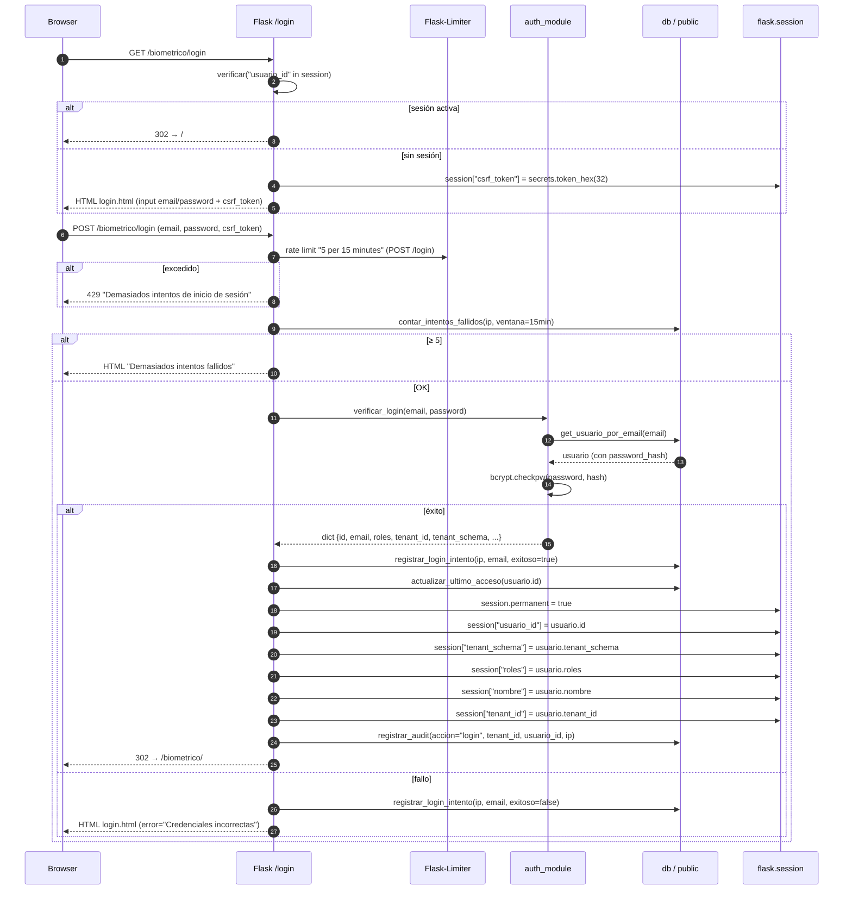
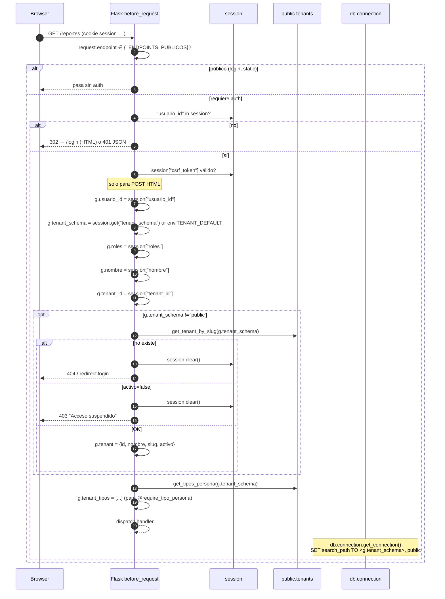

# Sistema de Autenticación y Control de Acceso

## Resumen

El sistema de autenticación combina cinco mecanismos complementarios:

1. **Sesión Flask** (cookie `HttpOnly` + `SameSite=Lax`) con expiración configurable (default 8 h).
2. **Hashing bcrypt** (cost 12) para contraseñas de usuarios en `public.usuarios`.
3. **CSRF custom** validado en `before_request` para todos los POST HTML. Tokens de 32 bytes en `flask.session`.
4. **Multi-tenant por schema** resuelto en cada request vía `g.tenant_schema` (cargado por sesión →
   `before_request` → disponible en handlers).
5. **AES-256-GCM** para cifrar credenciales de dispositivos ZK/Hikvision almacenadas en BD
   (campo `<tenant>.dispositivos.password_enc`).

El control de acceso se hace con dos decoradores componibles:

- `@require_role(*roles)` — al menos uno de los roles indicados.
- `@require_tipo_persona(nombre)` — exige que el tenant tenga configurado ese tipo de persona.

Los decoradores viven en `app/domain/rbac.py` (post-refactor; hoy en `decorators.py`) y se aplican sobre el
handler Flask. Toda la lógica de hashing, cifrado, login y CRUD de usuarios vive en `app/domain/auth.py`
(post-refactor; hoy en `auth.py` raíz). Ver [[ARQUITECTURA]] para el árbol de carpetas completo y la
motivación de la separación.

---

## Modelo de usuarios

### Tablas involucradas

| Tabla | Schema | Función |
|---|---|---|
| `usuarios` | `public` | Credenciales, roles, scopes y auditoría de acceso. |
| `tenants` | `public` | Inquilinos (instituciones) con su schema PostgreSQL dedicado. |
| `audit_log` | `public` | Bitácora de eventos sensibles (login, logout, alta/baja usuarios, etc.). |
| `login_intentos` | `public` | Rate limit secundario a `Flask-Limiter` (ventana de 15 min). |
| `tipos_persona` | `<tenant>` | Tipos de persona configurados por el tenant (ej. `Empleado`, `Practicante`). |
| `dispositivos` | `<tenant>` | Dispositivos biométricos con credenciales cifradas (AES-GCM). |

### `public.usuarios` — columnas clave

| Columna | Tipo | Descripción |
|---|---|---|
| `id` | uuid | PK. |
| `tenant_id` | uuid | FK a `public.tenants`. |
| `email` | text (unique) | Login. Se normaliza a minúsculas antes de comparar. |
| `password_hash` | text | Hash bcrypt (cost 12). **Nunca se expone al cliente.** |
| `nombre` | text | Nombre legible para la UI. |
| `roles` | text[] | Lista de roles (ver tabla abajo). |
| `configuracion` | jsonb | Scopes: `supervisor_grupo_id`, `supervisor_periodo_id`, etc. |
| `activo` | bool | Soft-delete. `false` = usuario desactivado. |
| `ultimo_acceso` | timestamp | Actualizado en cada login exitoso. |

### `public.tenants` — columnas relevantes

| Columna | Tipo | Descripción |
|---|---|---|
| `id` | uuid | PK. |
| `slug` | text (unique) | Identificador del schema PostgreSQL (ej. `istpet`). Va directo al `search_path`. |
| `nombre` | text | Razón social de la institución. |
| `nombre_corto` | text | Etiqueta corta. |
| `activo` | bool | Tenant suspendido: bloquea acceso (ver `autenticar_request` líneas 191-196). |
| `zona_horaria` | text | Default `America/Guayaquil`. |

### Relación usuario ↔ schema de tenant

```
public.tenants (id PK, slug, activo)
        ▲
        │  tenant_id (FK)
        │
public.usuarios (id, tenant_id FK, email, password_hash, roles[], activo, …)
        │
        │  después de login: session["tenant_schema"] = tenant.slug
        ▼
[schema <slug>]  (personas, asistencias, justificaciones, feriados, …)
```

El **schema activo** del usuario se resuelve en login y se guarda en `session["tenant_schema"]`. En cada
request posterior, el `before_request` (`app.py:156-227`) lo copia a `g.tenant_schema` antes de despachar
el handler, y `db.connection.get_connection()` lo aplica vía `SET search_path TO <slug>, public` antes de
ejecutar SQL.

### Los 6 roles

| Rol | Propósito | Permisos típicos |
|---|---|---|
| `superadmin` | Acceso global cross-tenant | Ver / crear / mover / desactivar usuarios entre tenants, gestionar tenants. |
| `admin` | Administrador de su tenant | CRUD de usuarios del tenant, dispositivos, horarios, periodos, justificaciones. |
| `gestor` | Gestor operativo | Generar reportes, importar horarios, crear justificaciones, ver analytics. |
| `supervisor_grupo` | Supervisor limitado a un grupo | Ver datos del grupo asignado (scope vía `configuracion.supervisor_grupo_id`). |
| `supervisor_periodo` | Supervisor limitado a un periodo | Ver datos del periodo asignado (scope vía `configuracion.supervisor_periodo_id`). |
| `readonly` | Solo lectura | Lectura sin modificación. |

Lista canónica en `decorators.py:20-27` (`ROLES_VALIDOS`).

### Tipos de persona

Los tipos de persona (`<tenant>.tipos_persona`) **no son roles**: son categorías funcionales del tenant
(empleado, practicante, visitante, etc.). Determinan qué pantallas y operaciones están disponibles para
esa institución. El decorador `@require_tipo_persona(nombre)` se usa para habilitar features cuya
disponibilidad varía por tenant (ej. workflows de practicantes que requieren contrato).

Ejemplo real en `decorators.py:78-114`: usado en vistas como `/periodos/nuevo` que requieren
`@require_tipo_persona('Practicante')`. Si el tenant no tiene ese tipo configurado, devuelve 403.

---

## Hashing de contraseñas

**Algoritmo**: `bcrypt` con cost 12.

**Dónde se aplica**: en `auth.py::hash_password(plain: str) -> str`:

```python
def hash_password(plain: str) -> str:
    return bcrypt.hashpw(
        plain.encode("utf-8"), bcrypt.gensalt(rounds=12)
    ).decode("utf-8")
```

El hash se almacena en `public.usuarios.password_hash` con el prefijo estándar `$2b$12$…`.

**Verificación**: `auth.py::verificar_password(plain, hashed) -> bool` usa `bcrypt.checkpw` dentro de un
try/except (devuelve `False` ante cualquier excepción para no revelar timings).

**Longitud mínima**: en `app.py:1830` (POST `/admin/usuarios` que llama a `auth_module.crear_usuario`),
se exige password de ≥ 8 caracteres. Los superadmins creados vía `/api/superadmin/usuarios` (línea 1994)
siguen la misma regla.

**Contraseñas temporales**: `auth.py::generar_temporary_password()` usa `secrets.token_urlsafe(12)` para
generar tokens URL-safe de ~12 caracteres. Se usan cuando el superadmin crea usuarios en otro tenant.

---

## Cifrado de credenciales de dispositivos

**Algoritmo**: `AES-256-GCM` (authenticated encryption).

**Llave**: variable de entorno `DB_ENCRYPTION_KEY` (32 bytes = 256 bits), codificada en base64 URL-safe.
Se genera con:

```bash
python -c "import secrets, base64; print(base64.b64encode(secrets.token_bytes(32)).decode())"
```

**Validación al cargar**: `auth.py::_get_encryption_key()` rechaza la app si la clave falta o no mide
exactamente 32 bytes.

**Operación de cifrado**: `auth.py::encrypt_device_password(plain) -> str`

```python
key = _get_encryption_key()
aesgcm = AESGCM(key)
nonce = secrets.token_bytes(12)
ciphertext = aesgcm.encrypt(nonce, plain.encode("utf-8"), None)
return base64.b64encode(nonce + ciphertext).decode("utf-8")
```

**Formato almacenado**: `base64(nonce[12] + ciphertext + tag[16])`. El GCM tag va al final del ciphertext
y `cryptography` lo valida en el descifrado.

**Operación de descifrado**: `auth.py::decrypt_device_password(enc) -> str` parsea el nonce y ciphertext
del blob y llama `aesgcm.decrypt(nonce, ciphertext, None)`.

**Dónde se aplica el cifrado**: en `app.py:564` y `app.py:580`, dentro de los handlers
`api_upsert_dispositivo` y `api_editar_dispositivo`. Si el request JSON incluye `password_enc`, se
cifra antes de llamar a `db_module.upsert_dispositivo(...)`.

**Dónde se descifra**: en `drivers/zk_driver.py` (y equivalentes), cuando el cliente ZK necesita la
contraseña para autenticarse contra el dispositivo físico.

**Rotación de claves**: **no soportada** (ver backlog P3). Rotar hoy requiere: (a) descifrar todos los
`password_enc` con la clave vieja, (b) recifrar con la nueva, (c) actualizar el `.env`.

---

## Flujo de login



Puntos críticos:

- **Doble rate limit**: `Flask-Limiter` (en memoria, default 5 / 15 min) + `contar_intentos_fallidos` en BD.
  Si se escala a multi-worker hay que mover el storage de Limiter a Redis (ver Trade-offs).
- **Audit obligatorio**: `registrar_audit(accion="login", …)` se llama dentro de `try/except` para no
  bloquear el login si la BD de auditoría falla.

---

## Sesión Flask

### Configuración

Definida en `app.py:57-60`:

```python
app.secret_key = os.getenv("FLASK_SECRET_KEY", "dev-secret-change-in-production")
app.config['PERMANENT_SESSION_LIFETIME'] = int(os.getenv("SESSION_LIFETIME_HOURS", "8")) * 3600
app.config['SESSION_COOKIE_HTTPONLY']  = True
app.config['SESSION_COOKIE_SAMESITE']  = 'Lax'
```

| Atributo | Valor | Por qué |
|---|---|---|
| `secret_key` | `FLASK_SECRET_KEY` (hex 64 chars recomendado) | Firma criptográfica de la cookie. |
| `PERMANENT_SESSION_LIFETIME` | 8 h (default) por `SESSION_LIFETIME_HOURS` | Sesión caduca tras 8 h incluso con actividad. |
| `SESSION_COOKIE_HTTPONLY` | `True` | Bloquea lectura desde JS (mitiga XSS-token-theft). |
| `SESSION_COOKIE_SAMESITE` | `Lax` | Mitiga CSRF de origen cruzado en navegación top-level. |
| `SESSION_COOKIE_SECURE` | (no seteado, depende de proxy) | En prod lo sirve el reverse-proxy; ver `X-Forwarded-Proto` en `ProxyFix`. |

> **Importante**: en producción **no** se debe confiar en el default. `FLASK_SECRET_KEY` debe ser una
> clave aleatoria de al menos 32 bytes generada con `python -c "import secrets; print(secrets.token_hex(32))"`.

### Qué se guarda en `session`

En login (`app.py:260-265`) y durante la vida de la sesión:

```python
session.permanent   = True
session["usuario_id"]    = usuario["id"]
session["tenant_schema"] = usuario["tenant_schema"]
session["roles"]         = usuario["roles"]
session["nombre"]        = usuario["nombre"]
session["tenant_id"]     = usuario["tenant_id"]
session["csrf_token"]    = secrets.token_hex(32)   # generado lazily en GET /login
```

Estos valores **no** incluyen `password_hash` ni secretos. El `before_request` los copia a `g` en cada
request para que los handlers los lean sin tocar la cookie.

---

## CSRF

### Implementación actual

`app.py:131-146` define el token y lo expone como global de Jinja:

```python
def generate_csrf_token() -> str:
    if "csrf_token" not in session:
        session["csrf_token"] = secrets.token_hex(32)
    return session["csrf_token"]

def validate_csrf() -> bool:
    if request.path.startswith("/api/"):
        return True   # Las API usan JSON, no formularios
    token = request.form.get("csrf_token") or request.headers.get("X-CSRF-Token", "")
    return bool(token and token == session.get("csrf_token"))

app.jinja_env.globals["csrf_token"] = generate_csrf_token
```

### Validación

Se ejecuta en `app.py:170-172` (dentro de `before_request`):

```python
# Validar CSRF para todos los POST que no sean API
if request.method == "POST" and not request.path.startswith("/api/"):
    if not validate_csrf():
        return jsonify({"error": "Token CSRF inválido"}), 403
```

### Endpoints exentos

| Caso | Razón |
|---|---|
| `GET *` | Métodos seguros (no modifican estado). |
| `/api/*` | Las APIs intercambian JSON; el `validate_csrf` retorna `True` sin chequear. Si se requiere CSRF para una API específica, enviar token en header `X-CSRF-Token`. |
| `/biometrico/login` (GET) | Renderiza el formulario inicial con el token ya inyectado. El POST sí valida. |

### Tabla de uso en templates

| Patrón en template | Propósito |
|---|---|
| `<input type="hidden" name="csrf_token" value="{{ csrf_token() }}">` | Token embebido en el form (lo lee `request.form.get("csrf_token")`). |
| `{{ csrf_token() }}` (llamada directa) | Para forms generados dinámicamente o para inyectar en JS (caso raro). |
| `fetch("/api/...", { headers: { "X-CSRF-Token": "{{ csrf_token() }}" } })` | Token como header (cuando se consume una API desde el mismo origen). |

### Por qué NO se migró a Flask-WTF

- Flask-WTF aplica CSRF a **todos los endpoints de la app, incluidas las APIs JSON**, lo que rompe el
  contrato actual (las APIs son JSON-only).
- Migrar requiere probar que todas las integraciones existentes (curl, scripts) no rompen.
- Decidido como **P2** en el backlog (ver [[ARQUITECTURA]]).

---

## Multi-tenant en auth



### Resolución thread-local

`db.connection` mantiene un `tenant_schema` por hilo de ejecución (importante para los threads daemon
del scheduler de sync). El `before_request` lo setea por request HTTP; los threads daemon lo setean
explícitamente con `db_module.set_thread_tenant(schema)` y limpian con `clear_thread_tenant()` (ver
`app.py:611-617`, `app.py:699-706`).

---

## Decoradores RBAC

`app.py:38-39` los importa: `from decorators import require_role, require_tipo_persona`. Post-refactor
será `from app.domain.rbac import …`.

### `@require_role(*roles)`

Firma: `@require_role("admin", "superadmin")` (al menos uno).

Comportamiento (`decorators.py:38-75`):

| Estado del usuario | Petición HTML | Petición API (Accept JSON o /api/) |
|---|---|---|
| Sin sesión | `302 → url_for("login")` | `401 {"error": "No autenticado"}` |
| Rol insuficiente | `403 HTML "Acceso denegado"` | `403 {"error": "Acceso denegado", "roles_requeridos": [...]}` |
| Rol suficiente | ejecuta handler | ejecuta handler |

Detección API (`decorators.py:30-35`): `request.path.startswith("/api/")` o `Accept: application/json`.

### `@require_tipo_persona(nombre_tipo)`

Firma: `@require_tipo_persona("Practicante")` (case-insensitive).

Comportamiento (`decorators.py:78-114`):

| Estado | HTML | API |
|---|---|---|
| Tenant tiene ese tipo en `g.tenant_tipos` | ejecuta handler | ejecuta handler |
| No lo tiene | `403 "Funcionalidad no disponible para tu institución"` | `403 {"error": "Esta funcionalidad no está disponible para tu institución."}` |

`g.tenant_tipos` se carga en `before_request` desde `<tenant>.tipos_persona`.

### Orden de evaluación

Los decoradores se aplican de abajo hacia arriba en la definición:

```python
@app.route("/periodos/nuevo")
@require_role("gestor", "admin", "superadmin")   # 2do: evalúa primero
@require_tipo_persona("Practicante")             # 1ro: se aplica más cerca del handler
def nuevo_periodo(): ...
```

En la práctica, esto significa que `@require_tipo_persona` corre **antes** que `@require_role` (porque el
decorador más cercano a la función envuelve primero al ejecutar la pila). Si los roles y los tipos son
independientes no importa; si un usuario sin rol también falla el check de tipo, verá el error de tipo
antes que el de rol.

### Uso típico

```python
@app.route("/periodos", methods=["GET"])
@require_role("admin", "superadmin", "gestor")
def periodos_lista(): ...

@app.route("/api/dispositivos", methods=["DELETE"])
@require_role("superadmin")
def api_eliminar_dispositivo(id): ...

@app.route("/admin/tenants", methods=["GET"])
@require_role("superadmin")
def admin_tenants(): ...
```

---

## Rate limiting

Implementado con `Flask-Limiter` (`app.py:62-68`):

```python
limiter = Limiter(
    get_remote_address,   # key = IP del cliente (vía ProxyFix)
    app=app,
    default_limits=[],
    storage_uri="memory://",
)
```

**Storage**: `memory://` (en proceso). **No compartible entre workers**. Migrar a Redis si se pasa a
multi-worker (ver backlog).

**Reglas activas** (ver `app.py:230-235`):

| Endpoint | Límite | Notas |
|---|---|---|
| `POST /login` | `5 per 15 minutes` | Llave = IP. Bloquea fuerza bruta. |
| (resto) | sin límite default | Se pueden añadir límites por endpoint con `@limiter.limit(...)`. |

**Limitador secundario**: `app.py:250` (`contar_intentos_fallidos(ip, ventana_minutos=15)`) hace lo
mismo en BD para protegerse ante reinicio del proceso (que pierde el storage `memory://`).

**Comportamiento en 429** (`app.py:70-76`):

| Petición | Respuesta |
|---|---|
| HTML | `redirect(url_for("login"))` + `flash("Demasiados intentos…", "danger")` |
| API (`/api/*` o `Accept: JSON`) | `429 {"error": "Demasiadas solicitudes. Espere 15 minutos."}` |

### Trade-off multi-worker

Si se escala gunicorn a `--workers >1`, cada worker tiene su propio `memory://` y el límite efectivo se
multiplica por N. Para que el límite sea global: `flask_limiter.RedisStorage` o `flask_limiter.MemcachedStorage`.
Esto **bloquea el rollout** del ADR-0001 Fase 6.

---

## Audit log

### Tabla `public.audit_log`

Esquema (inferido del uso en `app.py`):

| Columna | Tipo | Notas |
|---|---|---|
| `id` | uuid | PK. |
| `tenant_id` | uuid null | `null` si el evento es cross-tenant (acciones de superadmin global). |
| `usuario_id` | uuid | Quién ejecutó la acción. |
| `accion` | text | Verbo en snake_case. |
| `entidad` | text null | Tipo de entidad afectada (ej. `"usuario"`). |
| `entidad_id` | uuid null | ID de la entidad afectada. |
| `detalle` | jsonb null | Payload estructurado con contexto adicional. |
| `ip` | inet (text) | IP del cliente (vía `request.remote_addr`). |
| `created_at` | timestamp | Default `now()`. |

> Si la tabla real tiene otro esquema (ver `db/schema.py` y `db/migrations/`), ajustar. La
> documentación queda explícita sobre lo que **creemos** según el uso.

### Eventos registrados hoy

| Acción | Quién la emite | Línea en `app.py` |
|---|---|---|
| `login` | `autenticar_request` (vía `login`) | 268-274 |
| `logout` | `logout` | 290-296 |
| `superadmin_eliminar_usuario` | `api_superadmin_eliminar_usuario` | 1955-1965 |
| `superadmin_crear_usuario` | `api_superadmin_crear_usuario` | 2005-2015 |
| `superadmin_mover_usuario` | `api_superadmin_mover_usuario` | 2064-2078 |
| `crear_usuario` | `admin_crear_usuario` | 1854-1862 |
| `editar_usuario` | `admin_editar_usuario` | 1908-1917 |
| `desactivar_usuario` | `admin_editar_usuario` | 1896-1905 |
| `generar_pdf` / `generar_docx` | `generar_desde_db` | 900-908 |
| `limpiar_dispositivo` | `limpiar_dispositivo` | 995-1002 |

Todos envuelven la llamada a `db_module.registrar_audit(...)` en `try/except` para **no bloquear la
operación principal** si la BD de auditoría está caída.

### Lectura del audit log

**No expuesta hoy** vía UI. El panel de superadmin ([[SUPERADMIN]]) debería exponerla en P2.

---

## Logout

`app.py:286-300`:

```python
@app.route('/logout', methods=['POST'])
def logout():
    try:
        if "usuario_id" in session:
            db_module.registrar_audit(
                tenant_id=session.get("tenant_id"),
                usuario_id=session["usuario_id"],
                accion="logout",
                ip=request.remote_addr,
            )
    except Exception:
        pass
    session.clear()
    return redirect(url_for("login"))
```

Puntos:

- **Solo POST** (protección CSRF). No existe GET `/logout` por ese motivo.
- **`session.clear()`** invalida `csrf_token`, `usuario_id`, `tenant_schema`, `roles`, `nombre`,
  `tenant_id`.
- Audit en `try/except` para no bloquear el cierre de sesión.

---

## Casos especiales

### Superadmin cross-tenant

`superadmin` puede ver / gestionar **todos los tenants** sin pertenecer a ninguno. Su `tenant_schema` por
defecto es `public` (no tiene un schema operativo). Las rutas exclusivas de superadmin viven en
`/admin/superadmin/*` (HTML) y `/api/superadmin/*` (API) — ver [[API]] y [[SUPERADMIN]].

### Switch-tenant

`POST /admin/switch-tenant` (app.py:303-320+) permite al superadmin impersonar otro tenant:

1. Lee `tenant_slug` del form.
2. Si es `'public'`, vuelve al contexto global.
3. Si no, busca el tenant en `public.tenants`, lo asigna a `session["tenant_schema"]`.
4. El próximo request se ejecuta con ese schema activo.

Útil para soporte: depurar problemas de un cliente específico sin pedir credenciales.

> Riesgo: si el superadmin olvida volver a `'public'`, su sesión queda "atrapada" en el tenant. El logout
> lo limpia, pero no hay un timer que fuerce el regreso.

### Recuperación de contraseña

**No existe hoy**. No hay ruta pública de "olvidé mi contraseña" ni flujo de envío de email de reset.

Alternativas operativas (manuales):

1. Un `admin` entra al panel y crea un nuevo password temporal (`auth_module.crear_usuario` no actualiza,
   pero `auth_module.actualizar_roles` + `db.queries.auth.actualizar_password` — `[TODO]` verificar si
   existe la última función).
2. Un `superadmin` usa `/api/superadmin/usuarios` (POST) con `generar_password: true` y se le devuelve
   `password_temporal` en la respuesta.

Ver backlog P3 para añadir flujo público con token email.

### Provisionamiento inicial

`INITIAL_SUPERADMIN_EMAIL` y `INITIAL_SUPERADMIN_PASSWORD` en `.env.example` se usan **una sola vez** al
inicializar la BD (`crear_superadmin.py`):

```bash
python crear_superadmin.py --email admin@inst.edu.ec --nombre "Administrador"
```

---

## Configuración en `.env`

Variables que **afectan directa o indirectamente** el sistema de autenticación:

| Variable | Default | Propósito | Notas |
|---|---|---|---|
| `FLASK_SECRET_KEY` | `dev-secret-change-in-production` (¡cambiar!) | Firma criptográfica de la cookie de sesión. | Generar con `secrets.token_hex(32)` (64 chars). |
| `SESSION_LIFETIME_HOURS` | `8` | Segundos = valor × 3600. Define `PERMANENT_SESSION_LIFETIME`. | Entero positivo. |
| `DB_ENCRYPTION_KEY` | (debe estar) | Llave AES-256 (32 bytes en base64) para cifrar credenciales ZK/Hikvision. | Generar con `secrets.token_bytes(32)` + `base64.b64encode`. La app falla al arrancar si falta. |
| `TENANT_DEFAULT` | `istpet` | Schema por defecto cuando la sesión no tiene uno (caso borde). | Slug del tenant. |
| `INITIAL_SUPERADMIN_EMAIL` | (vacío) | Email del primer superadmin. | Usado solo por `crear_superadmin.py`. |
| `INITIAL_SUPERADMIN_PASSWORD` | (vacío) | Password del primer superadmin. | Idem. |
| `FLASK_DEBUG` | `false` | Activa el debugger de Werkzeug. **Nunca `true` en prod.** | Expone contraseñas. |
| `DATABASE_URL` | (Postgres local) | Conexión a la BD. Incluye `usuarios`, `tenants`, `audit_log`, `login_intentos` en `public`. | Sin esto, nada arranca. |
| `FLASK_HOST` / `FLASK_PORT` | `0.0.0.0` / `5000` | Bind address. | Habitual dejar default. |

> **Importante**: `FLASK_SECRET_KEY` y `DB_ENCRYPTION_KEY` **no** se rotan en caliente. Cambiarlas
> requiere reiniciar gunicorn y, en el caso de `DB_ENCRYPTION_KEY`, re-cifrar todos los `password_enc`
> existentes (script de migración).

> **Custodia obligatoria (Fase −1 del roadmap de [[ARQUITECTURA]])**: `DB_ENCRYPTION_KEY` debe
> respaldarse en un gestor de secretos o bóveda offline **separada de los backups de la BD**.
> Perder esta clave hace **irrecuperables** todas las credenciales de dispositivos cifradas
> (`password_enc`), aunque el backup de la base de datos esté intacto. Lo mismo aplica a
> `FLASK_SECRET_KEY` (su pérdida invalida todas las sesiones activas, aunque es regenerable).

---

## Backlog

### P2 (importante, no urgente)

- **Migrar CSRF custom a Flask-WTF** (`flask_wtf.CSRFProtect`). Mantener compat con `/api/*`
  configurando `csrf.exempt(...)` para blueprints API.
- **Exponer audit log en UI de superadmin** (panel "Actividad reciente" con filtros por usuario,
  acción, fecha).
- **Reforzar rate limiting de `/login`** per-email (hoy solo per-IP vía `Flask-Limiter`; el contador
  secundario en BD sí es por email).
- **Renovar tokens CSRF por sesión** (regenerar cada N minutos o tras eventos sensibles como cambio de
  contraseña).
- **Logging estructurado** de eventos de seguridad (login, logout, intentos fallidos) con destino
  centralizado (papertrail / Loki / Elasticsearch).

### P3 (futuro)

- **Rotación de claves AES-GCM**: script `rotate_db_encryption.py` que descifra con la vieja y
  recifra con la nueva, en transacción.
- **Recuperación de contraseña por email**: token firmado con TTL de 1 h, rate-limited, auditado.
- **2FA / TOTP** opcional para `superadmin` y `admin`.
- **Migrar `Flask-Limiter` a Redis storage** cuando se multi-worker (bloqueante para Fase 6 del
  roadmap).
- **OAuth / OIDC** para integraciones externas (hoy solo login email+password).

---

## Relacionado

- [[ARQUITECTURA]] — Diagrama de capas, árbol de carpetas, lugar donde vivirá post-refactor
  (`app/domain/auth.py`, `app/domain/rbac.py`).
- [[ADR-0001-modularizacion-monolito-flask]] — Decisión formal de extraer auth/rbac a `app/domain/*` con
  decoradores reusables y separación de capas.
- [[API]] — Inventario de endpoints, incluyendo las rutas afectadas: `/login`, `/logout`,
  `/admin/switch-tenant`, `/admin/usuarios*`, `/api/superadmin/usuarios*`.
- [[ER]] — Modelo de datos: `public.usuarios`, `public.tenants`, `public.audit_log`,
  `public.login_intentos`, `<tenant>.tipos_persona`, `<tenant>.dispositivos`.
- [[SUPERADMIN]] — Operaciones cross-tenant del superadmin (mover usuarios, switch-tenant, ver
  globales).
